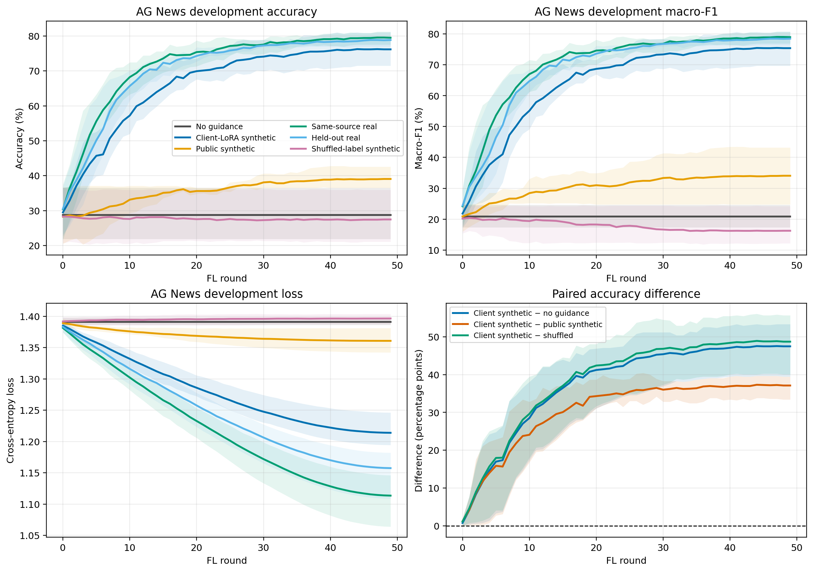

# AG News Non-DP Guidance Validation v3

**实验日期：** 2026-09-21

**任务：** Long-Horizon + Public Generator Control + Gradient/Subspace Diagnostics
**结论范围：** 本报告只讨论 Non-DP v3。未运行 DP-SGD、clipping、noise multiplier 或 epsilon scan。

## 结论

v3 在 3 个固定 seed、50 个 FL rounds 内得到一致结论：client-local LoRA synthetic guidance 不只是带来前期加速，其优势一直保持到 rounds 40–49 和第 50 次训练更新之后。它相对 no-guidance 的平均终点优势为 **+47.46 percentage points (pp)**，相对 public-synthetic 为 **+37.11 pp**，相对相同文本但打乱标签的 control 为 **+48.70 pp**；三个比较都在 3/3 seeds 上为正。

因此，RQ1 在本实验窗口内对应情形 2：**synthetic guidance 加速训练，并提高 50-round 最终 accuracy；no-guidance 没有在后期追上。** 这不等同于证明无限长训练后的最终收敛点。

RQ2 的行为结果和初始 checkpoint 梯度诊断方向一致。public pretrained DistilGPT2 加语义类别 prompt 本身带来有限收益，但无法解释 client-local LoRA synthetic 的主要收益。现有证据支持 client-local LoRA 学到了额外的 client/domain signal；由于只有 3 个 seeds 和固定 clients，这仍是机制支持证据，不是普遍性或统计显著性证明。

## 实验设计

| 项目 | 配置 |
|---|---|
| 数据集 | AG News，4 类 |
| Source clients | 1、21 |
| 固定 development clients | 900–908，按类平衡 |
| Seeds | 57、58、59 |
| 下游模型 | DistilBERT + adapter，FedFwd |
| FL 训练 | 50 rounds，每轮 2 个 logical clients，每轮评估 |
| 评估点 | 每个 arm 51 个：训练前 round -1，加 rounds 0–49 |
| Generator | DistilGPT2；client synthetic 使用 client-local LoRA，5 epochs |
| Prompt | `Category: {label}\nNews article:\n` |
| Synthetic budget | 每类 32，共 128；类别平衡 |
| Guidance weight | guidance arms `alpha=0.5`；no-guidance `alpha=1.0` 并跳过 cloud BP |
| Query budget | 每个 arm 3000 次 client objective queries，经 cross-arm validator 核验 |
| 隐私机制 | 无；noise multiplier=0，无 clipping，无 epsilon accountant |

六个 arms：

1. **No guidance**：保留相同同步流程，但 `alpha=1`，每轮跳过 cloud BP。
2. **Client-LoRA synthetic**：用 source client 私有记录分别训练本地 LoRA generator，再生成平衡 synthetic guidance。
3. **Public synthetic**：相同 DistilGPT2 base、prompt、decoding、长度、预算、过滤和标签平衡，但 generator 不构造 LoRA、不训练 optimizer，也不使用 client records 训练模型。
4. **Same-source real**：不可部署 oracle，使用相同 source clients 的真实记录，并匹配 synthetic 总量和标签序列。
5. **Held-out real**：使用保留 clients 的真实记录，匹配总量和类别预算。
6. **Shuffled-label synthetic**：复用 client synthetic 的完全相同文本和标签直方图，只确定性置换标签对应关系。

## 长程结果

### 第 49 轮终点

| Seed | No guidance | Client synthetic | Public synthetic | Same-source real | Held-out real | Shuffled-label |
|---:|---:|---:|---:|---:|---:|---:|
| 57 | 27.73% | **81.05%** | 42.58% | 81.25% | 76.95% | 25.39% |
| 58 | 36.52% | **75.98%** | 36.52% | 77.54% | 79.88% | 35.94% |
| 59 | 21.88% | **71.48%** | 38.09% | 79.69% | 79.69% | 21.09% |
| Mean | 28.71% | **76.17%** | 39.06% | 79.49% | 78.84% | 27.47% |
| Sample SD | 7.37 | 4.79 | 3.14 | 1.86 | 1.64 | 7.64 |

终点 macro-F1 均值依次为：no-guidance 20.84%、client synthetic **75.41%**、public synthetic 34.07%、same-source real 78.98%、held-out real 78.49%、shuffled-label 16.24%。accuracy 与 macro-F1 给出相同的相对排序。

### 轨迹统计

下表的 early 与 late 均排除训练前评估，分别对应 rounds 0–9 和 40–49。

| Arm | Early accuracy | Late accuracy | Final accuracy | Rounds 0–49 mean |
|---|---:|---:|---:|---:|
| No guidance | 28.71% | 28.71% | 28.71% | 28.71% |
| Client synthetic | **43.46%** | **76.09%** | **76.17%** | **66.06%** |
| Public synthetic | 29.80% | 38.98% | 39.06% | 35.64% |
| Same-source real | 51.17% | 79.36% | 79.49% | 71.61% |
| Held-out real | 48.05% | 78.61% | 78.84% | 70.19% |
| Shuffled-label | 27.98% | 27.41% | 27.47% | 27.63% |

| Paired comparison | Early 0–9 | Late 40–49 | Final | Rounds 0–49 mean |
|---|---:|---:|---:|---:|
| Client − No guidance | +14.75 pp | **+47.38 pp** | **+47.46 pp** | +37.35 pp |
| Client − Public | +13.66 pp | **+37.11 pp** | **+37.11 pp** | +30.42 pp |
| Client − Shuffled | +15.48 pp | **+48.68 pp** | **+48.70 pp** | +38.43 pp |
| Public − No guidance | +1.09 pp | +10.27 pp | +10.35 pp | +6.93 pp |

Client − no-guidance 的最终配对差为 seed 57/58/59 的 **+53.32/+39.45/+49.61 pp**；late-window 差为 **+53.18/+39.55/+49.39 pp**。差距没有随训练延长而缩小，反而从 early-window 的平均 +14.75 pp 扩大并在后期平台化。

Client − public 的最终差为 **+38.48/+39.45/+33.40 pp**，三个 seeds 均为正。public synthetic 相对 no-guidance 的最终改善为 **+14.84/0.00/+16.21 pp**，即只有 2/3 seeds 在终点严格为正。公开模型和类别 prompt 有贡献，但效果较慢、较小且 seed 依赖明显。

Client synthetic 相对 same-source real 平均低 3.32 pp，相对 held-out real 平均低 2.67 pp。seed 57 的 client synthetic 比 held-out real 高 4.10 pp，但 seed 58/59 分别低 3.91/8.20 pp。合成指导已接近相同预算真实指导的量级，但稳定性和最弱 seed 仍有改进空间。

### 达到准确率阈值的轮次

Client synthetic 达到 50% accuracy 的轮次为 seed 57/58/59 的 **4/9/9**；same-source real 为 **2/5/5**，held-out real 为 **3/7/7**。public synthetic、no-guidance 和 shuffled-label 在三个 seeds 中都没有达到 50%。public synthetic 只有 seed 57 达到 40%（round 29）；seed 58/59 均未达到 40%。

## Public generator control 审计

三个 seed 的 `validation_manifest.json` 均为 `complete`，以下检查全部通过：

- pretrained DistilGPT2 base 相同；
- prompt、decoding、generation length 相同；
- sample budget 和 class balance 相同；
- filtering configuration 相同；
- public generator 未构造 LoRA；
- public generator optimizer steps 为 0；
- client private records 未用于 public generator 训练；
- client/public synthetic 文件哈希均已记录并验证。

public 路径仍读取 source records 以执行与 client synthetic 相同的 exact-private-match release filter，但三个 seeds 中 public 和 client synthetic 的 exact-match reject 都为 0。因此私有记录没有训练 public generator，也没有实际改变 public 输出样本。

这个 control 的行为结论是：**pretrained LM + semantic prompt prior 只能解释 client synthetic 收益的一部分；client-local LoRA 是长期额外收益的关键差异。**

## 梯度与子空间诊断

诊断在下游任务模型的同一个初始 checkpoint 上离线完成。每个 seed 使用平衡的 client synthetic、public synthetic、shuffled-label、source real、held-out real 和 dev 样本；两 client 子空间由 source clients 1 和 21 的均值梯度张成，rank 不超过 2。

### Aggregate gradient alignment

| Guidance gradient | Cosine to source-real gradient | Cosine to dev gradient | Equal-norm one-step dev loss decrease |
|---|---:|---:|---:|
| Client synthetic | **0.8148** | **0.8030** | **0.006561** |
| Public synthetic | 0.6678 | 0.6352 | 0.005152 |
| Shuffled-label synthetic | 0.1682 | 0.1820 | 0.001430 |
| Held-out real | 0.8770 | 0.9129 | 0.007481 |
| Source real | 1.0000 | 0.9113 | 0.007435 |

Client synthetic 对 source-real 的 cosine 在每个 seed 上都高于 public synthetic：

- seed 57：0.7768 vs 0.6007；
- seed 58：0.8754 vs 0.7903；
- seed 59：0.7923 vs 0.6123。

### Two-client subspace coverage

| Two-client subspace | Source-real gradient energy captured | Dev gradient energy captured |
|---|---:|---:|
| Client synthetic | **0.6681** | **0.6478** |
| Public synthetic | 0.4539 | 0.4119 |
| Shuffled-label synthetic | 0.1318 | 0.1237 |
| Source real | 1.0000 | 0.8314 |

Client synthetic 子空间捕获 source-real gradient energy 的逐 seed 值为 **0.6100/0.7664/0.6279**，public 为 **0.3619/0.6246/0.3752**。local LoRA 在 3/3 seeds 上都更接近真实 client 子空间。

Client 与 public synthetic 子空间的两个 principal cosines 分别为：seed 57 `[0.7063, 0.1064]`、seed 58 `[0.8524, 0.1701]`、seed 59 `[0.6854, 0.1693]`。两者共享一个较强方向，但第二方向接近正交，说明 public prompt prior 与 local-LoRA signal 有部分重合，也存在明显差异。

这些诊断支持行为实验，但不单独证明多轮优化因果：它们只测量一个初始 checkpoint、一个等范数单步更新和 rank-2 子空间，也不测量 DP 行为。

## 完整性与数值质量检查

- 18/18 arms 状态为 `complete`。
- 每个 arm 都有训练前评估和 rounds 0–49，共 51 个评估点。
- 每个 arm 都有 3000 次 client objective queries；所有 arms 的轮次、logical-client schedule、模型命令和 artifact 哈希通过 cross-arm validator。
- 三个 public generator manifests 均通过 8 项专门检查。
- 三个 gradient/subspace diagnostics 均为 `complete`。
- 本地重新运行汇总后，`summary.json` 和 `curves.csv` 与服务器输出逐字节一致。
- 便携结果归档 SHA-256：`ae13bab890ea0ff383b701bc2280f37b735b21ab6b730175cd8daef751cc26b0`。

长程 no-guidance 中观察到极少数 central finite-difference 方向因浮点分辨率得到零差值：seed 57 为 2/1500 directions、seed 58 为 1/1500、seed 59 为 2/1500，对应非零率 99.8667%/99.9333%/99.8667%。每次训练调用都至少保留一个非零方向；其余五个 arms 在全部 seeds 上均为 100% 非零。validator 将这些数量显式记录，没有隐藏或删除对应轮次。该现象应在后续数值稳定性工作中处理，但其规模不足以解释 37–49 pp 的 guidance 差异。

## 限制与可支持的表述

本实验支持以下表述：

> 在固定 AG News clients、3 个 seeds 和 50-round Non-DP FedFwd 设置下，client-local LoRA synthetic guidance 大幅加速了学习，并在整个后期窗口保持相对 no-guidance、public pretrained generator 和 shuffled-label control 的大幅准确率优势。public semantic prompt prior 有有限贡献；梯度与两 client 子空间诊断进一步支持 local LoRA 提供额外 client/domain signal。

本实验不能支持以下更强表述：

- 不能声称统计显著性；只有 3 个 seeds，未做假设检验或置信区间设计。
- 不能声称最终收敛；只观察到 50 rounds 内的持续优势和后期平台化。
- 不能声称跨 client partition、跨数据集或跨模型普遍成立。
- 不能声称 DP 可行或任何隐私保证；本实验完全 Non-DP，local LoRA 可能记忆私有文本。
- 梯度诊断不能替代端到端消融，只作为初始 checkpoint 的机制证据。

## 文件索引

- `summary.json`：完整逐 seed、逐 arm、paired 与 diagnostic 结构化结果。
- `curves.csv`：18 个 run 的 918 个评估记录，含 accuracy、macro-F1 和 loss。
- `METRICS.md`：核心终点与 paired 指标速查。
- `v3_training_curves.pdf` / `v3_training_curves.png`：四面板完整轨迹图。
- `../matpool_agnews_nondp_v3_seed{57,58,59}/`：原始日志、commands、manifests、cross-arm validation、public validation 和 gradient/subspace diagnostics。
- `../agnews_nondp_v3_results.tar.gz`：不含重复 `model_output` checkpoints 的便携审计归档；服务器完整结果仍保留。

实验按任务要求在完成本报告后停止，未启动任何 DP 实验。
